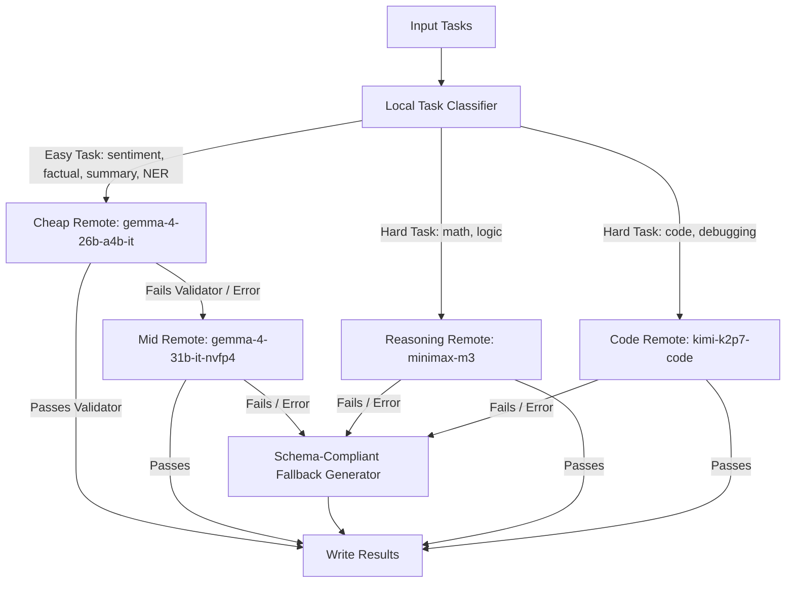

# Track 1 — Token-Efficient Remote Cascade Routing Agent

A cost-optimal, highly resilient AI routing agent implementing a multi-model remote inference cascade for Track 1 of the AMD Developer Hackathon.

## Architecture Overview

The agent is designed to maximize remote token efficiency and accuracy using an asynchronous cascade pipeline executing entirely against the Fireworks API (using allowed models):



1. **Local Classifier (Regex/Rules)**: Asynchronously classifies prompts on CPU without touching external APIs, routing them to the optimal starting tier.
2. **Easy Categories Cascade**: Factual knowledge, sentiment classification, NER, and summarization tasks query the cheap `gemma-4-26b-a4b-it` model first. If output validation fails or a network timeout occurs, it automatically escalates to the mid-tier `gemma-4-31b-it-nvfp4` model.
3. **Direct Hard Category Routing**: High-complexity categories bypass the cheap tier completely and query dedicated high-capability models:
   - `math_reasoning`, `logical_reasoning` $\rightarrow$ `minimax-m3` directly.
   - `code_generation`, `code_debugging` $\rightarrow$ `kimi-k2p7-code` directly.
4. **Resiliency Failbacks**: Tasks failing all validation checks or API calls (e.g. 404s/transient connectivity issues) fall back to zero-cost, schema-accurate dynamic fallback generators to guarantee valid output file generation under any runtime condition.

---

## Environment Variables

The agent expects the following environment variables:

| Variable | Description | Example |
| :--- | :--- | :--- |
| `FIREWORKS_API_KEY` | Fireworks API Key | `fw_...` |
| `FIREWORKS_BASE_URL` | Base URL for the Fireworks endpoints | `https://api.fireworks.ai/inference/v1` |
| `ALLOWED_MODELS` | Comma-separated list of allowed models | `minimax-m3,kimi-k2p7-code,gemma-4-26b-a4b-it,gemma-4-31b-it,gemma-4-31b-it-nvfp4` |
| `DEV_MODE` | Optional toggle for GGUF local model execution (Default: `false` for production remote-only submissions) | `false` |
| `MAX_REMOTE_CONCURRENCY`| Maximum concurrent remote I/O calls | `12` (Default) |

---

## Getting Started (Local Run)

### 1. Install Requirements
```bash
pip install -r requirements.txt
```

### 2. Generate sample tasks
```bash
python run_local_demo.py
```

### 3. Run the Agent
Ensure you have the required environment variables exported, then run:
```bash
python main.py
```

---

## Docker Build & Deployment

### 1. Build the container
```bash
docker build --platform linux/amd64 -t hybrid-routing-agent .
```

### 2. Run the container
Mount your host `/input` and `/output` directories (containing `tasks.json`):
```bash
docker run \
  -v $(pwd)/input:/input \
  -v $(pwd)/output:/output \
  -e FIREWORKS_API_KEY=your_key \
  -e FIREWORKS_BASE_URL=https://api.fireworks.ai/inference/v1 \
  -e ALLOWED_MODELS=minimax-m3,kimi-k2p7-code,gemma-4-31b-it,gemma-4-26b-a4b-it,gemma-4-31b-it-nvfp4 \
  hybrid-routing-agent
```

---

## Automated CI/CD (GitHub Actions)

A GitHub Actions workflow is pre-configured in `.github/workflows/build-push.yml`. When you push to your repository, it automatically builds the AMD64 container and publishes it to the GitHub Container Registry:

```bash
ghcr.io/<your-username>/<your-repo-name>:latest
```
