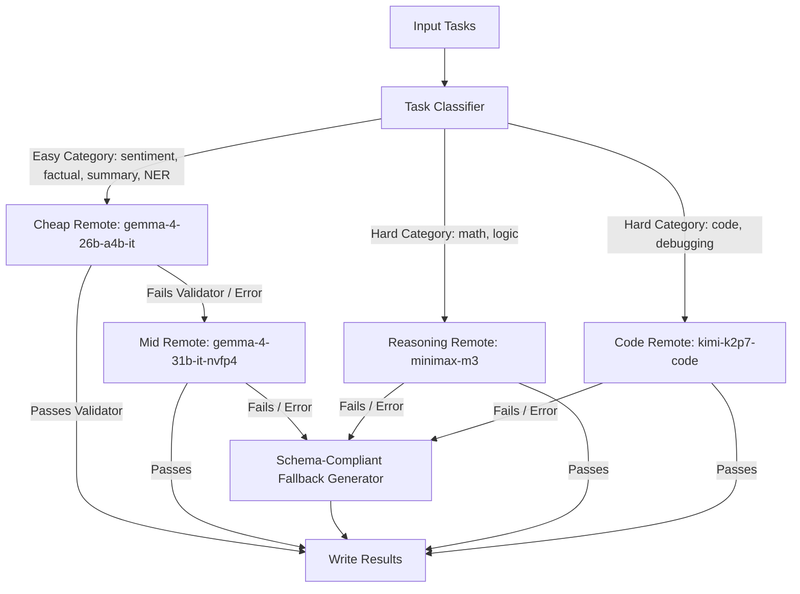

# Track 1 — General-Purpose AI Agent for Multi-Category Tasks

A highly resilient, general-purpose AI agent optimized to handle 8 NLP and coding task categories, utilizing cost-optimal Fireworks API model selection for token and cost efficiency.

## Architecture Overview

The agent executes a unified inference pipeline against the Fireworks API, selecting the cheapest capable model category-by-category to minimize token counts and latency while maintaining high semantic accuracy:



1. **Category Routing**: Classifies input prompts locally on CPU into one of 8 target categories to determine the optimal starting model tier.
2. **Cheap-to-Strong Cascade (Easy Categories)**: Factual knowledge, sentiment classification, NER, and summarization tasks start at the cheap `gemma-4-26b-a4b-it` model. If output validation fails, it automatically escalates to the mid-tier `gemma-4-31b-it-nvfp4` model.
3. **Direct Strong Model Query (Hard Categories)**: Mathematical reasoning, logical puzzles, code generation, and debugging bypass the cheap tier to query specialized reasoning and code models directly:
   - `math_reasoning`, `logical_reasoning` $\rightarrow$ `minimax-m3` directly.
   - `code_generation`, `code_debugging` $\rightarrow$ `kimi-k2p7-code` directly.
4. **Resiliency Fallbacks**: Prompts failing validation checks or API calls (e.g. 404s/transient errors) fall back to zero-cost, schema-accurate dynamic fallback generators to guarantee valid output file generation under any runtime condition.

---

## Environment Variables

The agent expects the following environment variables:

| Variable | Description | Example |
| :--- | :--- | :--- |
| `FIREWORKS_API_KEY` | Fireworks API Key | `fw_...` |
| `FIREWORKS_BASE_URL` | Base URL for the Fireworks endpoints | `https://api.fireworks.ai/inference/v1` |
| `ALLOWED_MODELS` | Comma-separated list of allowed models | `minimax-m3,kimi-k2p7-code,gemma-4-26b-a4b-it,gemma-4-31b-it,gemma-4-31b-it-nvfp4` |
| `DEV_MODE` | Optional toggle for GGUF local model execution (Default: `false` for production remote-only submissions) | `false` |
| `MAX_REMOTE_CONCURRENCY`| Maximum concurrent remote I/O calls | `12` (Default) |

---

## Getting Started (Local Run)

### 1. Install Requirements
```bash
pip install -r requirements.txt
```

### 2. Generate sample tasks
```bash
python run_local_demo.py
```

### 3. Run the Agent
Ensure you have the required environment variables exported, then run:
```bash
python main.py
```

---

## Docker Build & Deployment

### 1. Build the container
```bash
docker build --platform linux/amd64 -t general-purpose-agent .
```

### 2. Run the container
Mount your host `/input` and `/output` directories (containing `tasks.json`):
```bash
docker run \
  -v $(pwd)/input:/input \
  -v $(pwd)/output:/output \
  -e FIREWORKS_API_KEY=your_key \
  -e FIREWORKS_BASE_URL=https://api.fireworks.ai/inference/v1 \
  -e ALLOWED_MODELS=minimax-m3,kimi-k2p7-code,gemma-4-26b-a4b-it,gemma-4-31b-it,gemma-4-31b-it-nvfp4 \
  general-purpose-agent
```

---

## Automated CI/CD (GitHub Actions)

A GitHub Actions workflow is pre-configured in `.github/workflows/build-push.yml`. When you push to your repository, it automatically builds the AMD64 container and publishes it to the GitHub Container Registry:

```bash
ghcr.io/amanm006/hybrid_routing-v1:v17
```

### Hackathon submission (exact image reference)

Use this **exact** string in the submission form (no `https://`, must include tag):

```
ghcr.io/amanm006/hybrid_routing-v1:v17
```

**Valid tags:** `v17`, `latest` (also `v017` / `v.017` aliases after CI rebuild)

**Invalid (will cause PULL_ERROR):**
- `ghcr.io/amanm006/hybrid-routing-v1:v17` (hyphen — package uses underscore)
- `ghcr.io/amanm006/hybrid_routing-v1:v.017` (only after alias publish; use `v17` until then)
- `ghcr.io/amanm006/hybrid_routing-v1` (missing tag)
- `https://ghcr.io/...` (no URL prefix)

Verify before submitting:
```bash
docker logout ghcr.io
docker pull ghcr.io/amanm006/hybrid_routing-v1:v17
```

Package must be **Public**: GitHub → Packages → `hybrid_routing-v1` → Package settings → Change visibility.
