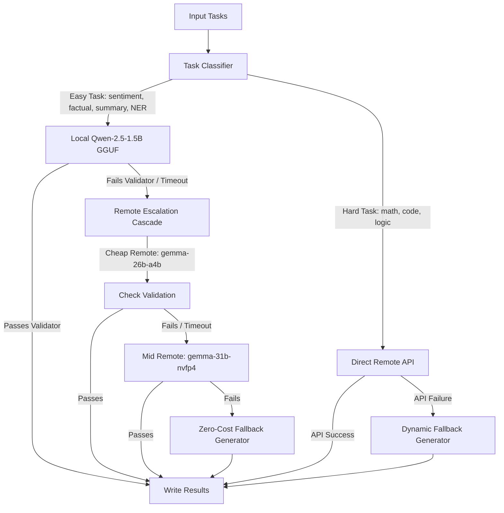

# Track 1 — Hybrid Token-Efficient Routing Agent

A cost-optimal, highly resilient AI routing agent implementing a hybrid inference pipeline for Track 1 of the AMD Developer Hackathon.

## Architecture Overview

The agent utilizes a split-inference strategy to minimize remote token counts and latency while meeting strict LLM-Judge accuracy gates:



1. **Classification Tier**: Classifies task prompts asynchronously using regex rules and keywords (with safety biases toward hard categories).
2. **Local Tier (Easy Categories)**: Queries a native local `llama-server` process running a quantized **Qwen-2.5-1.5B-Instruct-Q4_K_M.gguf** model.
3. **Remote Cascade Tier**: Escalates only on validation failures or local timeouts to remote Fireworks API endpoints (`cheap` model $\rightarrow$ `mid` model).
4. **Resiliency Fallbacks**: Prompts that fail remote models (e.g. 404s/transient errors) trigger zero-cost, schema-accurate dynamic fallback generators.

---

## Environment Variables

The agent expects the following environment variables:

| Variable | Description | Example |
| :--- | :--- | :--- |
| `FIREWORKS_API_KEY` | Fireworks API Key | `fw_...` |
| `FIREWORKS_BASE_URL` | Base URL for the Fireworks endpoints | `https://api.fireworks.ai/inference/v1` |
| `ALLOWED_MODELS` | Comma-separated list of allowed models | `minimax-m3,kimi-k2p7-code,gemma-4-26b-a4b-it,...` |
| `MAX_LOCAL_CONCURRENCY` | Maximum concurrent local model slots (Optional) | `3` (Default) |
| `MAX_REMOTE_CONCURRENCY`| Maximum concurrent remote I/O calls (Optional) | `12` (Default) |

---

## Getting Started (Local Run)

### 1. Install Requirements
```bash
pip install -r requirements.txt
```

### 2. Download local GGUF model
```bash
python download_model.py
```

### 3. Generate sample tasks
```bash
python run_local_demo.py
```

### 4. Run the Agent
Ensure you have the required environment variables exported, then run:
```bash
python main.py
```

---

## Docker Build & Deployment

### 1. Build the container
```bash
docker build --platform linux/amd64 -t hybrid-routing-agent .
```

### 2. Run the container
Mount your host `/input` and `/output` directories (containing `tasks.json`):
```bash
docker run \
  -v $(pwd)/input:/input \
  -v $(pwd)/output:/output \
  -e FIREWORKS_API_KEY=your_key \
  -e FIREWORKS_BASE_URL=https://api.fireworks.ai/inference/v1 \
  -e ALLOWED_MODELS=minimax-m3,kimi-k2p7-code,gemma-4-31b-it,gemma-4-26b-a4b-it,gemma-4-31b-it-nvfp4 \
  hybrid-routing-agent
```

---

## Automated CI/CD (GitHub Actions)

A GitHub Actions workflow is pre-configured in `.github/workflows/build-push.yml`. When you push to your repository, it automatically builds the AMD64 container and publishes it to the GitHub Container Registry:

```bash
ghcr.io/<your-username>/<your-repo-name>:latest
```
